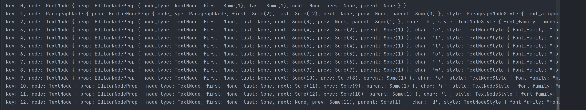

# 关于

## 编辑器的现状

目前市面上编辑器按授权方式区分主要分为开源和闭源，其中闭源最出名的的就是`word`，开源领域比较常见的(web端)是`prosemirror`,
`lexical`等。
目前开源的几个编辑器最大的问题是不支持类似word那种分页模式。不支持的原因我猜测一是基于DOM本身去计算分页异常的复杂，二是这些开源的富文本编辑其崇尚的一个概念
`所见所得`。<br/>
假设现在我要基于开源项目二次开发，实现一套支持分页的富文本编辑器几乎是不可能的。我也了解了`word`
的web端实现，完全是通过DOM拆分来实现的，就目前编译后的源代码格式化之后都有接近20w行，这让我对MicroSoft在文字处理器领域的积累肃然起敬,可见这是一个非常庞大的项目。 <br/>
当然国内做的最好的是`腾讯文档`，有兴趣可以研究一下实现。腾讯文档（包括`google doc`
）是完全基于canvas绘制的。飞书文档我猜测是考虑到分页开发难度太大没有做分页模式。<br/>
以上只是做了简单的介绍，更加详细的市场情况可以自己去详细了解，这里不做过多的赘述。

## 市场需求

做任何事情我们都要了解市场需求，目前市面上开源的带分页的编辑器基本没有（`canvas-editor`
无法上生产）。假设我现在要做一个文书类的产品，并且需要稳定、接入简单、价格合理，从目前的现状来看是肯定找不到的。

## nex-editor

在多次权衡后决定自己开发一个编辑器，以下是这么做的原因

1. rust（选择rust是因为编辑器需要强大性能和稳定性 恰好rust本身就是为了内存安全而生）
2. 基于上另一个原因是跨平台（rust可以编译成平台代码运行在各种设备上）
3. 保护源码（核心代码不开源，通过wasm分发，这样利于收费定制）

## 架构设计

既然选择了rust这门非常基础的系统级别开发语言，这就意味着包括从文字的渲染都是需要自己实现的，这里的实现对于WEB开发而言往往是不存在的，因此需要转换以下思维。我们可以把文本编辑器想象成一个巨大的二维数组，
我们需要控制每一个像素点。其中rust的职责如下

- 文字解析绘制（解析文本 生成对应的像素点绘制到二维数组中）
- 数据结构（数据结构可以参考state.md）
- 排版（也就是我们常说的layout）
- 渲染 （可以简单的理解把对应的像素点点亮）
- 提供结构返回这张图片

浏览器端职责

- 处理事件（比如文本输入、鼠标移动）
- 从rust侧获取渲染结构放到canvas渲染

我们可以看到最核心的内容均在rust中完成，这样可以很好的保护我们的代码，便于后续的定制开发收费等

## 数据结构

编辑器整个是一个树，一个简单的文档可以表示成下面的结构

```text
---- root
---------paragraph
------------------text node 
------------------text node 
------------------text node 
------------------text node 
```

这部分代码在`src/editor/editor_state.rs`中可以看到`append_node`等函数来处理这个数据结构 最终输出的结构是下面这个样子的



这个结构其实表示的内容如下

```text
---- root
---------paragraph
------------------text node h
------------------text node e
------------------text node l
------------------text node l
------------------text node o
------------------text node 
------------------text node w
------------------text node o
------------------text node r
------------------text node d
```

每个节点有next last first prev parent将这些节点都联系起来了。首先在你脑子里不要存在任何编辑器显示相关的东西，我们专注于这个数据结构
这个数据结构就是表示了root节点下面有一个段落 段落里面有10个字符 也就是文字节点。

那我举个常见的例子，现在我要描述这样一种结构 root下有ul list（有序列表，这在编辑器里面也很常见） 每个list有文字 那是不是就是如下数据结构

```text
---- root
---------ul list
----------------ul list item
----------------------------text node 1
----------------ul list item
----------------------------text node 2
```

那这个是不是就是一个有序列表 列表里面有两个节点 分别是`1`和`2`,我相信这很简单。假设我们要删除某一个段落 只需要更新这个结构即可
我们所有的操作就围绕这个接口

## 布局

从上面的数据结构是不是感觉布局非常的困难，假设我们有嵌套的结构整个事情就会变得非常困难了呢？是的！但是软件是用来解决现实中的问题的，所以，做过打印的同学应该知道，我们没有处理嵌套。
我们只处理我们已知的数据结构就行了，这其实是符合编辑器使用的，相信你使用编辑器的时候没有在单元格里面套表格的吧！我们只需要处理对应场景的布局即可。
因此我们需要处理的常见的布局为

- paragraph + text
- heading + text
- ul + item + text

更多的就不过多的罗列了，只要记住我们只布局我们已知的内容即可。记住，绝不嵌套！

## 渲染

我们把整个文书想象成一个巨大的图片，我们处理里面的每一个像素。当然实际是没有那么底层，这里我们使用skia来做绘制。具体我已经写了render，在
`src/render/skia.rs`中我绘制了一个`g`的字母到Pixmap里。你可放开
下面的保存文件注释。运行以下你会发现一个文字渲染到图片上了。生成的文件在`target/test.png`
。是的，现在的代码是非常简单的。只要思路没问题，后续的工作我们都会觉得很简单了吧！对吗？
